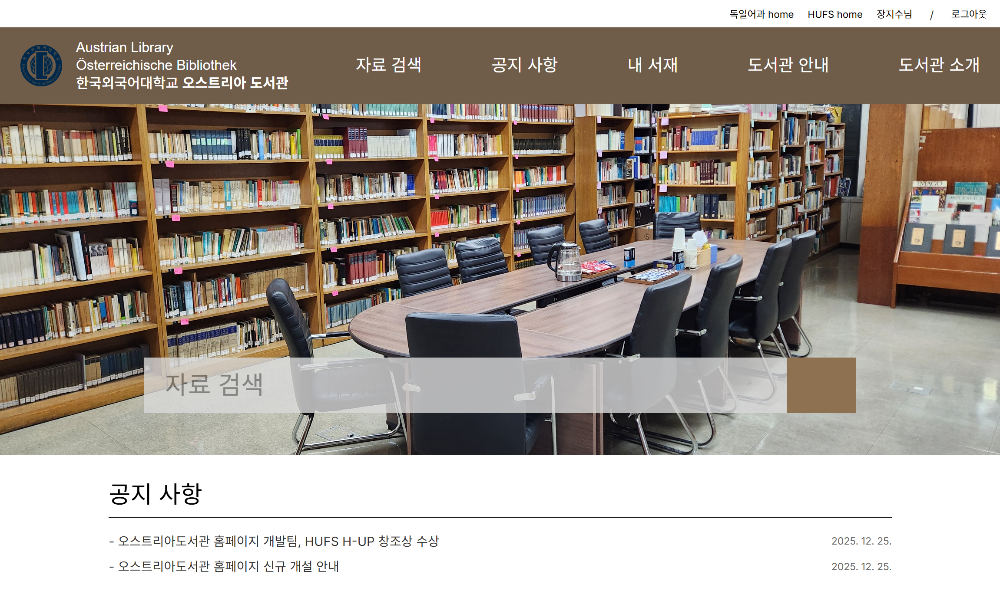

# 오스트리아도서관 디지털화 프로젝트 Austrian Library Digitalization Project

본 프로젝트는 한국외국어대학교 서양어대학 독일어과 부속 오스트리아도서관의 물리적 공간 개편부터 디지털 도서 목록 구축, 그리고 웹 홈페이지 개발까지 포함된 통합 프로젝트입니다.  
<div align="center">
  
</div>

## Quick Links
- **Web Homepage** (https://ohjigo-library.vercel.app/#/)
- **프로젝트 개발 회고록** (./RETROSPECTIVE.md)

## 폴더 구조 
```text
austrian_library_project/
├── docs/                        # 프로젝트 관련 문서
│   └── images/                  # 프로젝트 관련 이미지  
├── AI_module/                   # 머신러닝 및 자연어처리 모듈
│   └── book_genre_classifier/   # [ML] 도서 장르 자동 분류 모델
├── README.md                    # 프로젝트 전체 개요 및 기술 스택
└── RETROSPECTIVE.md             # 프로젝트 개발 회고록
```

## Tech Stack
- Development
    - Language: Python, JavaScript
    - Frontend: React, CSS
    - Backend: Django, Django Rest Framework
    - Database: PostgreSQL

- Deployment & Infra
    - Frontend Hosting: Vercel
    - Backend Hosting: Render
    - Database Hosting: Neon DB
    - Monitoring: Uptime Robot