# [개발 회고록] 맨땅에 헤딩으로 일궈낸 오스트리아도서관 풀스택 구축기

## 1. 문제 정의 및 프로젝트 기획

  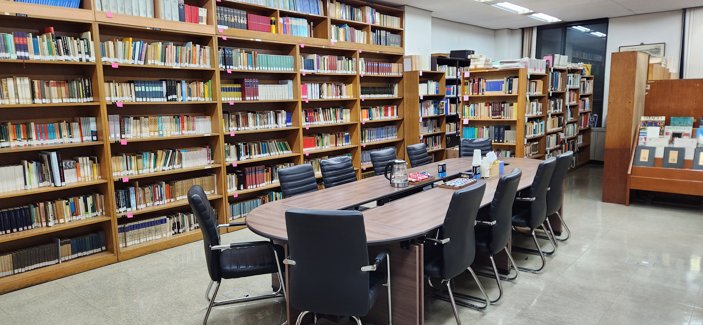

서울특별시 동대문구 이문로 107 한국외국어대학교 서울캠퍼스 본관 301호에 위치한 독일어과 부속 **오스트리아도서관 (Austrian Library, Österreichische Bibliothek)**은 1982년 오스트리아 대사관으로부터 직접 독일어 서적 수천 권을 기증받으며 시작되었습니다. 국내에서 희귀한 독일어권 문학·어학에 관한 독일어 원서를 보유한 전문 도서관으로서 그 가치가 매우 높으나, 운영 시스템은 40년 전의 아날로그 방식에 머물러 있어 다음과 같은 세 가지 핵심 문제점이 존재하였습니다.

1. **데이터 관리의 취약성 - SPOF(Single Point of Failure)**: 5,000여권의 서적들 중 일부만 디지털 데이터로 존재하였으며, 심지어 이는 관리자 PC 바탕화면의 로컬 엑셀 파일 하나에 의존되고 있었습니다. 실제로 제가 학부생 조교로 근무하던 1학기 당시에 데이터 일부가 유실되어 복구에 실패한 사례가 있었으며, 외부에서는 도서 소장 여부를 전혀 확인할 수 없는 폐쇄적인 구조였습니다.

  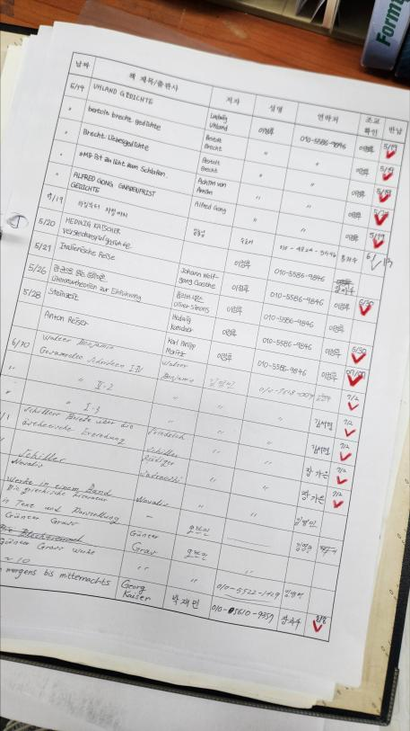
  
디지털화 이전 대출 장부

2. **데이터 무결성 및 관리 효율 저하**: 도서 대출·반납이 수기 장부로 이루어져 기록의 누락이나 유실 위험이 존재하였습니다. 또한, 통계 산출이나 연체 관리가 불가능하여 체계적인 도서관 운영에 한계가 있었습니다.

3. **물리적 인프라의 한계**: 중복 도서 과다, 책장 부족으로 인한 이중 적재 등 서고의 물리적 공간이 한계에 도달하여 신규 기증 도서 전시가 불가능한 상황이였고 분류 기호 혼재 등 관리가 미흡하였습니다. 

  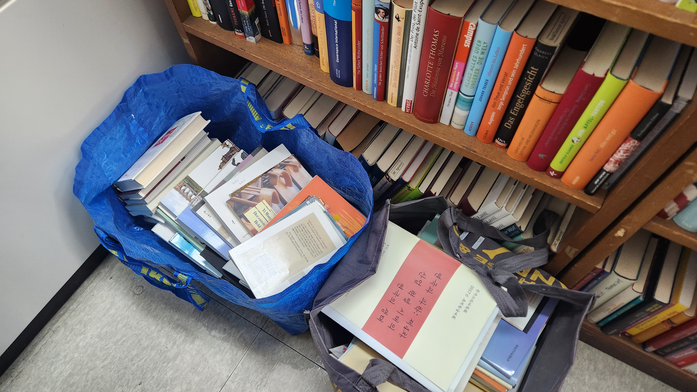
  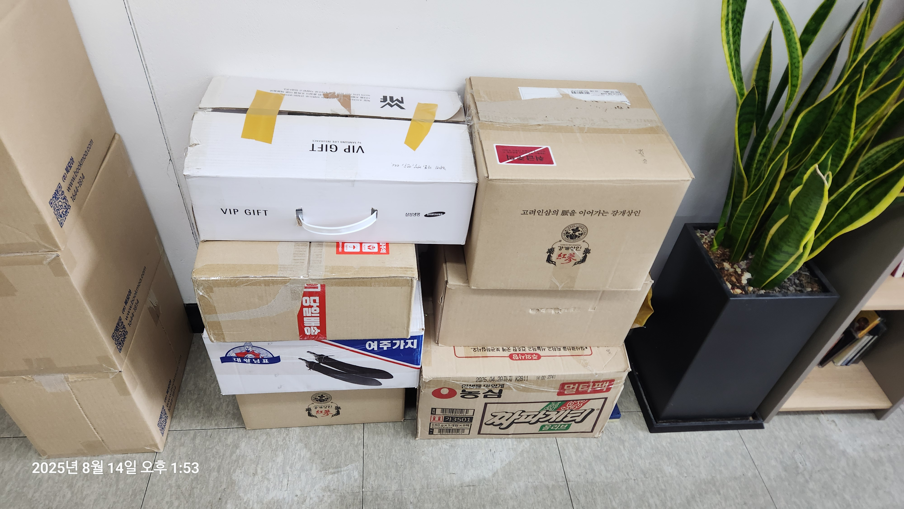
  
공간 부족으로 인해 정리되지 못하고 마구잡이로 쌓여있던 도서들

위 문제점들은 제가 2025학년도 1학기 '학부생 조교'로 근무하며 현장에서 직접 겪은 페인 포인트(Pain Point)였습니다. 그리하여 저는 단순히 불편함을 느끼는데 그치지 않고, **도서관 운영 시스템의 디지털 전환**이라는 근본적인 해결책을 제안했습니다. 그 결과, 2학기에는 단순 조교를 넘어 프로젝트의 방향성을 결정하고 리딩하는 '오스트리아도서관 총 책임자인 공로봉사 장학생'으로 발탁되어 본 프로젝트를 주도하게 되었습니다.

해당 프로젝트는 제가 오스트리아도서관 공로봉사 장학생으로 근무한 기간인 2025년 7월 ~ 2025년 12월에 걸쳐 이루어졌습니다.

## 2. 공간 및 물리적 인프라 재구성
본격적인 디지털화를 진행하기에 앞서 시스템이 돌아가기 위해서는 데이터를 담을 물리적 공간을 개선하는 것이 시급했습니다. 소프트웨어의 효율성은 결국 하드웨어의 안정성에서 나온다고 판단하여 다음과 같은 과정을 수행했습니다.

1. **데이터 선별**: 보존 가치가 낮은 중복 도서 및 파손 도서를 선별하여 폐기했습니다. 이를 통해 서고의 혼잡도를 낮추고 실제 유의미한 데이터를 위한 가용 공간을 확보했습니다.

2. **0원 인프라 확충**: 예산이 없는 상황에서 인프라를 확충하기 위해 발로 뛰었습니다. 교내 본관 뒷편의 가구 쓰레기장을 상시 모니터링하여 상태가 양호한 책장 3개를 확보하였고, 인문관의 생활자치도서관과 협의하여 미사용 책장 1개를 추가로 수거했습니다. 예산 없이 총 4개의 책장을 확보하여, 고질적인 문제였던 이중 적재를 완전 해결하고 신규 기증 도서를 위한 전용 섹션을 신설할 수 있었습니다.

  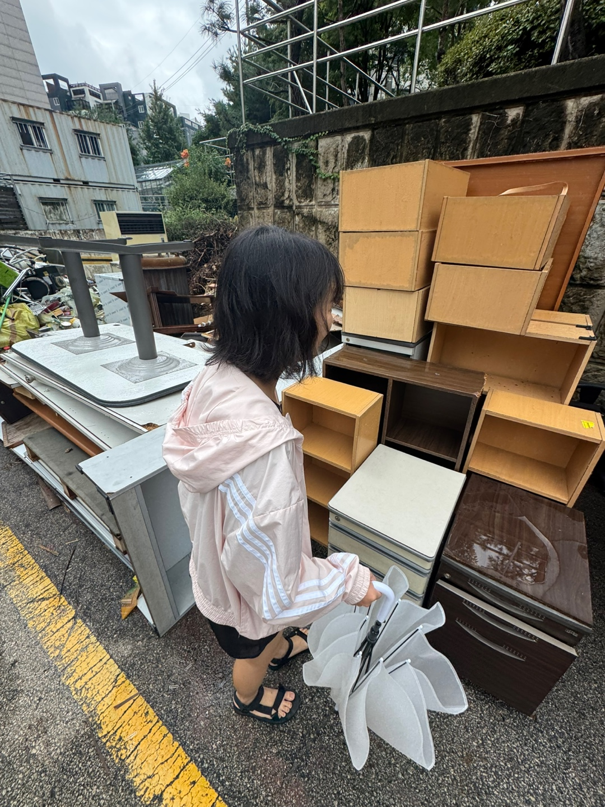
  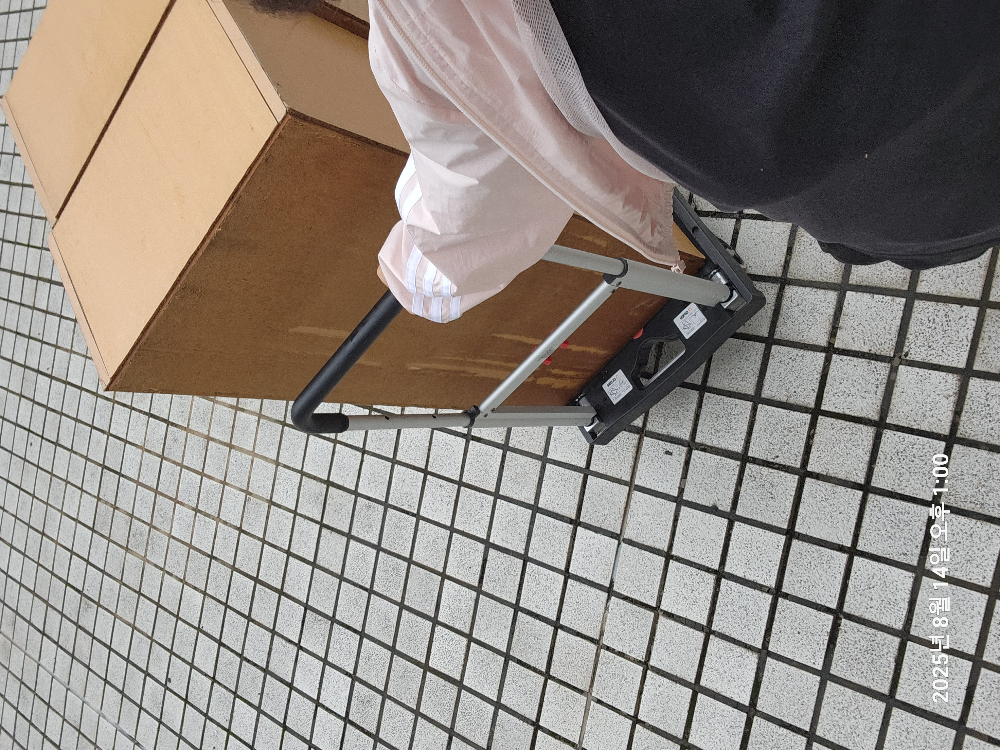
  
교내 본관 뒷편의 가구 쓰레기장에서의 세 번째 책장 확보

3. **서고 재배치 및 물리적 네비게이션 구축**: 
- 정합성 확보: 기존의 서고는 실제 공간 배치와 무관하게 분류 기호(A~D)가 뒤섞여 있었고, 일부 책장은 뒷면이 정면을 향하는 등 비효율적으로 배치되어 있었습니다. 이를 전면 재배치하여 물리적 도서 위치와 디지털 분류 코드를 일치 시켰습니다.
- 사용자 경험(UX) 개선: 기존에 존재하지 않았던 도서관 평면도를 직접 제작했습니다. 이는 웹 시스템에서 도서 위치를 확인한 사용자가 실제 서고에서 헤매지 않고 목적지에 도달할 수 있게 돕는 물리적 인터페이스 역할을 합니다.

  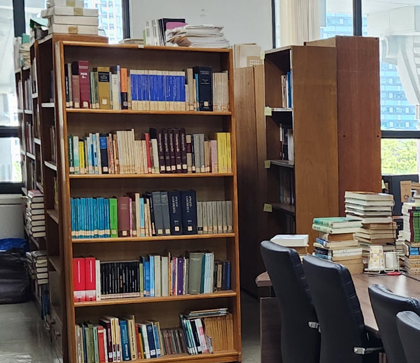
  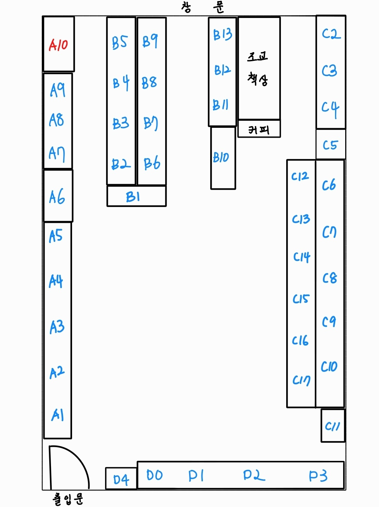
  
(좌) 책장의 뒷면이 정면을 바라보는 예전 배치 / (우) 직관적인 도서 탐색을 위해 직접 제작한 평면도

## 3. 데이터 엔지니어링: AI를 활용한 업무 프로세스 혁신
기존의 도서 전산화 방식은 학부 조교들이 수천 권의 데이터를 수동으로 입력하며 데이터 무결성이 훼손될 위험이 컸습니다. 저는 총 책임자로서 이 문제를 해결하고자 머신러닝 기반의 자동화 파이프라인 구축을 구축하였습니다.

### 1. AS-IS: 아날로그 방식의 한계 
1. **데이터 품질의 불균형**: 조교들의 독일어 숙련도 차이로 인해 저자-출판사를 혼동하여 기입하거나, 장르 구별에 실패하는 등 데이터의 품질이 균일하지 못했습니다.

2. **비효율적 청구기호 체계**: 사람이 직접 기호를 조합하여 입력하다 보니 오타가 빈번했으며, 기존 청구기호 체계는 중복을 허용하는 구조로서 청구기호로서의 의미가 없었습니다.

3. **운영 리스크 및 낮은 생산성**: 입력 항목이 과다하고 난이도가 높아 전산화 속도가 더뎠고, 1학기 당시 데이터 일부 유실 사고가 발생하는 등 관리 체계가 전무했습니다.

### 2. TO-BE: 기술 기반 프로세스 최적화 
저는 관리자로 승진함과 동시에 조교들이 독일어에 능숙하지 않아도 데이터의 정확성을 보장할 수 있는 환경을 설계했습니다.

1. **입력 공정의 추상화**: 조교들에게는 직관적으로 알 수 있는 도서명, 저자, 위치 정보만 입력하도록 업무를 단순화했습니다. 복잡한 판단이 필요한 장르와 청구기호는 시스템에서 자동 생성하도록 분리했습니다.

  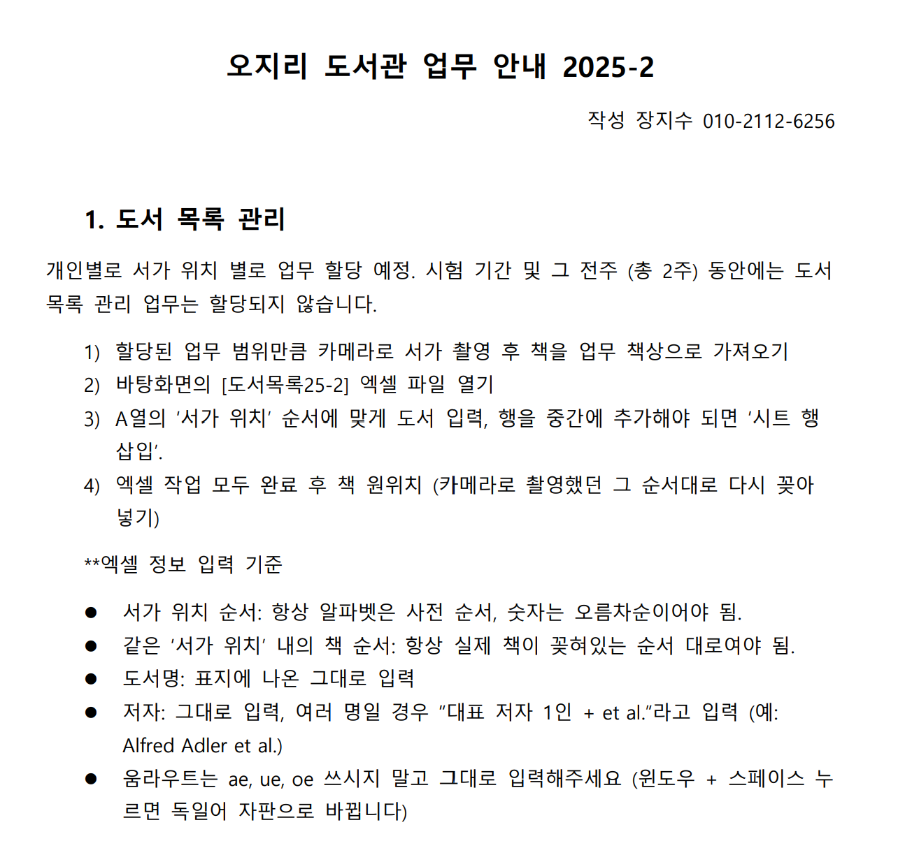
  
OT에서 배포한 업무 가이드라인 중 일부

2. **mBERT 기반 장르 자동 분류 (NLP)**: 
- 서비스 링크: https://huggingface.co/spaces/jsjang0104/book-genre-classifier-service

  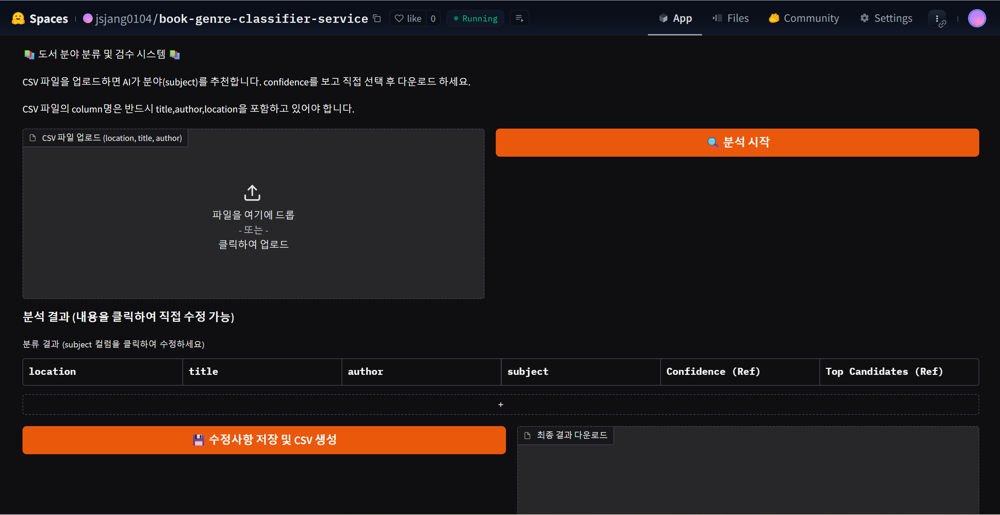

- 제목을 기반으로 장르를 자동으로 분류하는 machine learning model을 도입했습니다. 조교가 독일어 장르를 판단할 필요 없이, 입력된 도서명을 바탕으로 모델이 가장 적합한 카테고리를 제안합니다.

- 독일어,한국어,영어가 섞여있고, 언어학/문학/사회과학/역사/기타로 편중되어 있는 소장 도서들의 특징에 맞춰 mBERT를 채택하여 fine-tuning 하였습니다.

- 학문적 연계: Language&AI융합학부 전공과목 '기계학습의이해(최승택 교수님)'의 과제와 연계하여 모델의 신뢰성을 확보하였습니다.

- 자세한 내용은 "./AI_module/book_genre_classifier/"에서 확인할 수 있습니다.

3. **규칙 기반 청구기호 생성 로직**
- 데이터를 입력받아 청구기호를 자동으로 생성합니다. 이를 통해 human error에 의한 기호 중복 및 오류를 0%로 차단하였습니다.
- logic flow
    - input: 도서의 메타 데이터 (제목,저자,위치,언어)가 입력된 csv 파일
    - output: 규칙에 따라 생성된 고유 청구기호 (위치_제목_저자_분야_언어_순서)가 추가된 정제된 csv 파일
- 구현 단계
    1. 데이터 정규화: 파일 내 모든 문자열을 전처리 (ä,ü,ö,ß를 영어식 표현 ae, ue, oe, ss로 매핑 및 한자를 한글로 매핑, 공백 제거, 소문자 변환)
    2. deterministic hashing: 제목 및 저자에 대하여 hashlib 라이브러리를 이용한 해시 생성 후 16진수를 10진수 변환, 이후 지정된 자릿수에 맞게 나머지 연산을 수행하여 고유 문자열 생성. 이를 통해 동일한 도서 데이터에 동일 기호를 생성하는 결정론적(deterministic) 특성을 확보
    3. 중복 서적 관리: 딕셔너리를 이용하여 중복 도서에 대한 순서 부여 (Key: 튜플 (위치, 제목, 저자, 분야, 언어), Value: 현재까지 등장한 횟수)

### 3. 결과 및 성과
1. **생산성의 비약적 향상**: 업무 난이도 하락에 따라 조교 1인당 데이터 처리 속도가 약 3배 이상 비약적으로 상승했습니다.

2. **데이터 무결성 확보**: 정제되지 않은 raw data를 data base 스키마에 맞게 정규화하여, 수천 권의 도서를 체계적으로 관리할 수 있는 토대를 마련했습니다.

3. **지속가능한 운영 체제 구축**: "기술이 사람의 숙련도를 대체할 수 있다"는 것을 입증하며, 독일어를 전혀 모르는 인원도 도서관 전산화 작업에 즉시 투입될 수 있는 유연한 인력 운영 구조를 확립했습니다. 또한 데이터 정제 시스템을 서비스로 배포함으로서 제가 관리직에서 물러난 후에도 공학적 지식이 없는 후임자가 데이터를 정제하고 관리할 수 있도록 기술적 제반 시스템을 완비하였습니다.

## 4. Full-Stack 시스템 개발 및 운영
### 1. Technical Stack
- Frontend (장지수): React 기반 Single Page Application. 한국외국어대학교 및 독일어과 공식 홈페이지와 UI/UX 디자인의 통일성을 확보
- Backend (박재민, 양수찬): Django REST Framework(DRF)를 활용하여 API 서버 구축
- Database (장지수, 박재민): PostgreSQL (Neon DB)을 사용하여 도서 및 사용자 간 관계형 데이터 구조를 설계
- DevOps (장지수): Vercel (FE), Render (BE), Uptime Robot (모니터링)을 조합하여 zero-cost 서비스 배포 환경을 구축하고 실시간 가용성 확보

### 2. Full-Stack 개발 
- 초기 기획 당시에는 프론트엔드 및 UI Design (본인), 백엔드 (타 팀원 2인)으로 역할을 나누었으나, 프로젝트의 완결성과 마감 기한 준수를 위해 제가 전체 개발 공정을 포괄하는 방식으로 기술적 문제를 해결했습니다.
- Rapid Prototyping: LLM을 활용한 프롬프트 엔지니어링을 통해 개발 속도를 극대화하고, 짧은 기간 내에 목표를 달성했습니다.
- 통합 구조 설계: 데이터 스키마 설계부터 UI 컴포넌트 구현까지 전 과정을 직접 관리함으로써 기획 의도와 실제 구현 결과물 사이의 간극을 최소화했습니다.

### 3. 전략적 시너지: 학문적 가치 및 공신력 확보
단순한 개발 프로젝트를 넘어, 대학의 혁신 지원 사업과 연계하여 프로젝트의 가치를 대외적으로 인정받았습니다.
- 진로탐색학점제 HUFS H-UP 연동: '독일어'와 '컴퓨터 공학'을 접목한 진로 탐색을 위한 활동이라는 프로그램 목적을 인정받아 개발 동력을 확보하였습니다. 이는 언어학적 자산을 공학적 도구로 현대화하는 융합적 시도였습니다.
- 학문적 연계: Language&AI 융합학부 박준형 교수님께서 지도 교수님으로 자문해 주심으로서 학문적 공신력을 확보하였습니다.
- 성과 - '창조상' 수상: 포괄적인 홈페이지 개발 워크플로우를 직접 설계 및 구현하고 언어학과 공학을 접목하여 우리 도서관이 겪고 있던 문제들을 실질적으로 해결한 점을 높이 평가받아 '창조상'을 수상하였습니다. 수상을 통해 기술력과 공신력을 대외적으로 입증받았으며 프로젝트 성과는 한국외국어대학교 대학혁신지원사업 수기집에 게재될 예정입니다.

  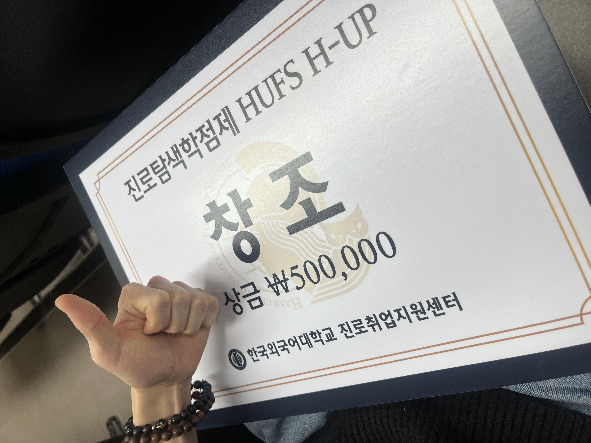

- 비하인드: 아쉽게도 저는 이미 2024년도 동일 프로그램에서 소논문 <독일의 동물 진료비용 표준 수가제에 관한 고찰> 작성을 통해 수상한 경력이 있어, 수상자는 재참가가 불가능하다는 답변을 받아 이번 진로탐색학점제에 참여 공식적으로 명단을 올리지는 못하였습니다. 다른 개발 팀원들(박재민, 양수찬)만 참가한 것으로 기록이 되어 있습니다.

### 4. 핵심 기능 구현
단순한 도서 목록 나열을 넘어, 사용자의 편의성과 관리 효율을 극대화하기 위한 기능들을 직접 설계하고 구현했습니다.

1) 사용자 관점: 독일어 특화 검색 및 개인화 서비스
- **독일어 특수 문자 입력 한계 극복**: 독일어 전용 자판이 없는 사용자를 위하여 독일어 특수문자인 ä,ü,ö,ß를 영어식 표현 ae, ue, oe, ss로 매핑하였습니다. 영어식 표현을 사용하여 입력하여도 독일어 표현의 검색 결과를 반환하여 검색어를 전처리함으로서 사용자 접근성을 높였습니다. 

- **필터링 검색**: 언어(한/독/영), 분야(문학/어학 등), 대출 가능 여부에 따른 동적 필터링을 통해 편리하게 원하는 도서 정보를 검색할 수 있습니다.

  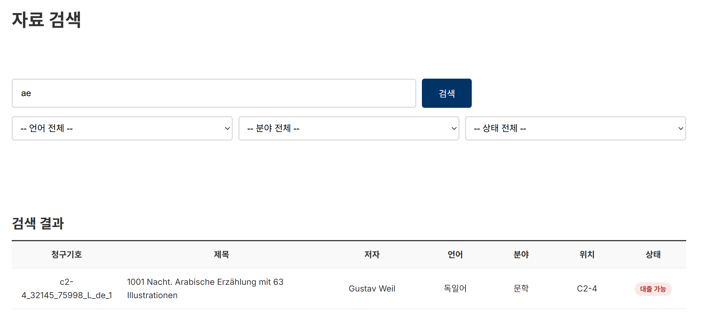
  
독일어 문자 'ä' 대신 영어식 표현인 'ae'를 입력해도 독일어 표현이 포함된 단어 'Erzählung'이 반환되는 모습

- **보안**: 개인정보 최소 수집 원칙에 따라 학번, 닉네임, 신분, 이메일, 비밀번호만 수집하며, 비밀번호는 Django의 라이브러리를 이용하여 암호화됩니다. 관리자도 원본 비밀번호를 확인할 수 없도록 설계하여 보안 사고를 차단하였습니다.

- **'내 서재'**를 통한 실시간 관리: 수기 장부 시절에는 불가능했던 대출 현황 및 반납 예정일 조회를 원격으로 가능하게 구현함으로서 이용자 편의를 극대화하였습니다.

  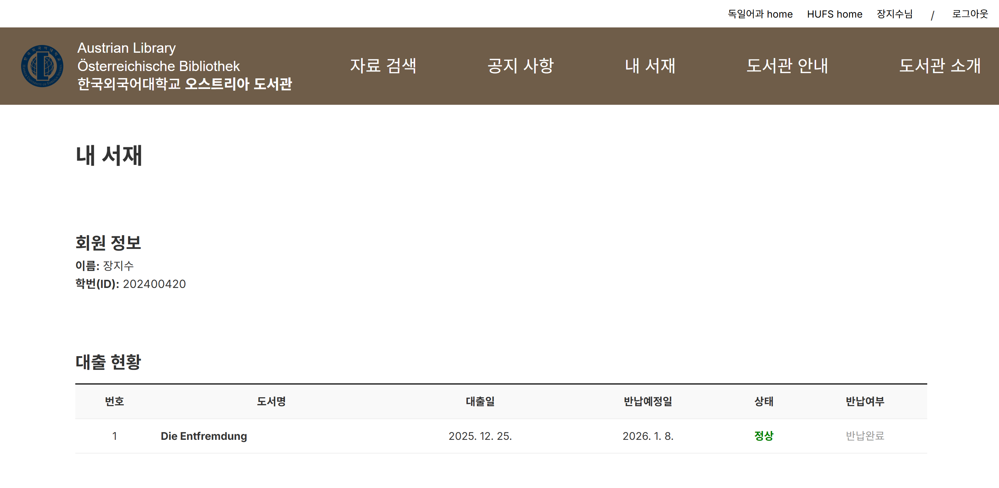
  
대출 현황 및 반납 예정일을 조회할 수 있는 '내 서재'

2) 관리자 관점: 데이터 관리 자동화 및 확장성
- **대량 데이터 벌크 업로드**: ML 모델과 파이썬 로직으로 생성된 수천권의 도서 데이터를 csv형태로 Django Admin 페이지에서 클릭 한 번으로 일괄 등록할 수 있는 시스템을 구축하였습니다.

  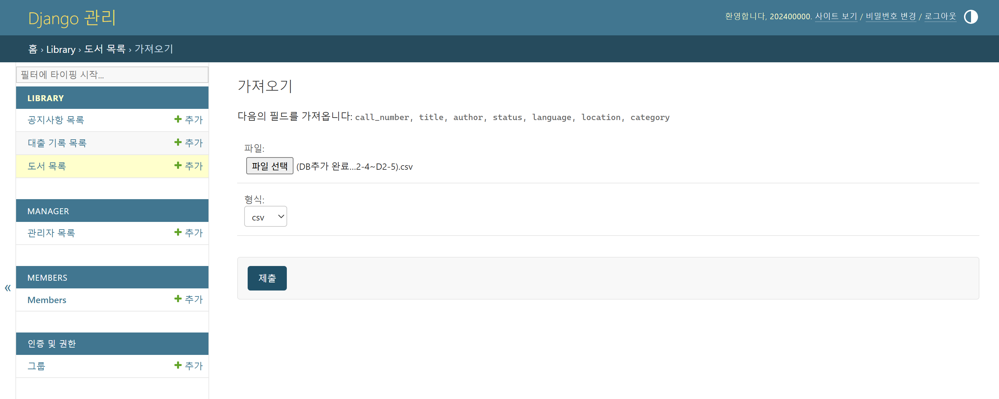
  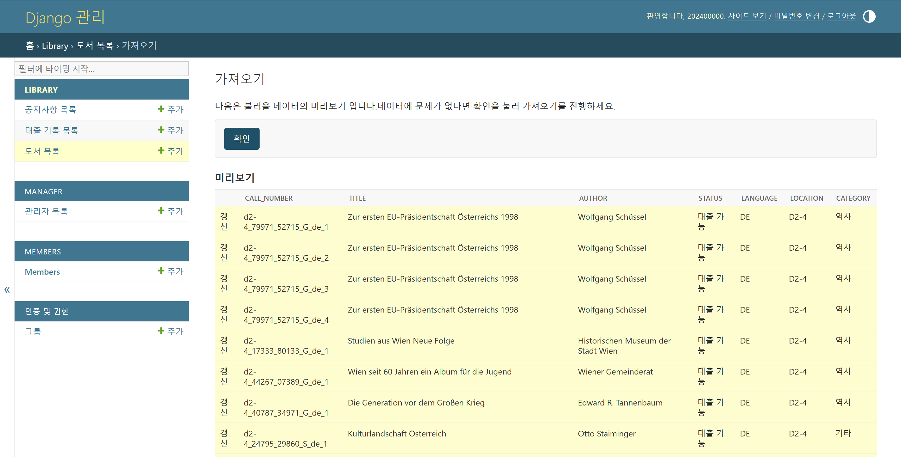
  
csv 파일을 읽어와 데이터 일괄 등록

- **운영 가시성 확보**: 기존에는 도서관의 문 앞에 종이를 붙여놓는 방식으로만 가능했던 공지 전달 방식을 홈페이지의 공지사항 기능을 통해 실시간으로 전파할 수 있게 하였습니다.

  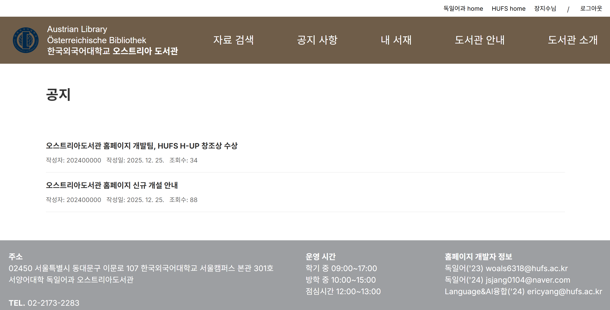

3) 기술적 해결: 안정적인 서비스 배포 및 모니터링
- **Serverless 아키텍처**: Neon DB(PostgreSQL)와 Vercel/Render를 활용하여 트래픽에 따라 유연하게 대응하는 서버 환경을 구축했습니다.

- **상태 모니터링**: Uptime Robot을 연동하여 백엔드 서버의 가동 상태를 실시간 감시하고, 장애 발생 시 메일로 해당 내용을 전송 받음으로서 즉각 대응할 수 있는 관리 환경을 마련했습니다.

## 5. 성과 및 회고
이 프로젝트는 단순한 개발 경험을 넘어, 인문학적 자산을 공학적 사고로 현대화하여 문제 해결의 전 과정을 주도(End-to-End)했다는 점에서 큰 의미가 있습니다. 특히 이는 한국외국어대학교라는 인문학 중심의 교내 환경에서 인문학과 공학을 동시에 전공하는 학생으로서의 정체성을 발휘하여 그 특수성을 흔치 않은 가치로서 승화시킨 사례라고 할 수 있겠습니다.
이러한 시도는 단순한 프로젝트로 끝나지 않고 대학혁신지원사업 프로그램 수상이라는 정량적 가치로도 이어졌으며, 학교 측으로부터 기술력과 실용성을 동시에 인정 받았습니다.
또한 AI를 단순히 코드를 복사하는 도구가 아닌, 개발 속도와 퀄리티를 극대화해주는 파트너로서 활용하였습니다. 이를 통해 반복적 코딩 및 디버깅에 쓰이는 시간과 노동력을 줄이고 아키텍쳐 설계와 로직 검증 등의 고차원적인 문제 해결에 더 많은 리소스를 투자할 수 있었습니다. 앞으로 컴퓨터공학 전공자로서 어떤 부분에서 AI를 전략적으로 도구화할 것인지, 그리고 그렇게 절약한 시간 및 노동력을 다른 어떤 핵심 가치에 재투재해야 될지에 대해 미래의워크 플로우에 대한 통찰력을 얻을 수 있었습니다.