# An Item Response Theory Framework to Evaluate Automatic Speech Recognition System Against Speech Difficulty

**Author:** Chaina Santos Oliveira, Ricardo B.C. Prudêncio  
**Journal/Year:** Computer Speech and Language 95/2026

---

## 1. Introduction

- Importance of ASR evaluation
  - Essential for selecting the appropriate techniques to adopt in particular applications
  - Essential for understanding the advantages and limitations of existing techniques

- Aspects which ASR evaluations usually relies
  - (1) Audio speech test dataset (human speaking, synthesized speech)
  - (2) Performance measure to assess the quality of the transcriptions (WER)

- Limitation of existing method
  - The quality of an ASR system is usually assessed by aggregating the result across the items in the test set
  - This method sometimes fails
  - Aggregating a given performance measure -> the variety of difficulties in dataset are ignored

- Solution
    1. Item Response Theory (IRT): A theory to simultaneously evaluate ASR systems and the difficulty of test speeches
    2. Recognizer Characteristic Curve (RCC): A plot of ASR performance versus speech difficulty
    3. ASR fingerprint: A plot with the system's performance is visualized against sentence difficulty and speaker quality

- Experiment
  - Target: 4 different ASR tools
  - Testset: 75,000 speeches (additional noise was injected with three different levels)

## 2. Item Response Theory in AI evaluation

- Item Response Theory (IRT)
  - A paradigm developed in Psychometrics
  - Returns the ability of each AI system
  - Estimates the difficulty of each test task
- ${𝛽^3}$-IRT: IRT model which current paper used
  - For bounded, continuous responses
  - Item Characteristic Curve (ICC):
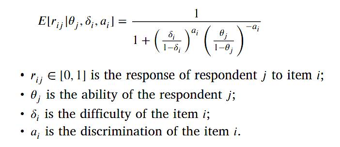
  - Beta distribution: model estimates the difficulites and abilities in a range [0,1]
  - Respondent's ability depends on "average response" and "correct answers on difficult items"
  - Item's difficulties: depend on the number of high-ability repondants
- General road map for applying IRT in AI evaluation
    1. choose a pool of systems
    2. choose a benchmark set of tasks
    3. evaluate the performance of each system on each task in order to collect the set of responses
    4. fit an appropriate IRT model (depends on the domain of response (binary vs continuous))

## 3. IRT evaluation in ASR

### 3.1 Two-level IRT model to estimate difficulty in ASR

#### 1st level

- Objective: To measure the "ability" ($\theta$) of each ASR system and the "difficulty" ($\delta$) of each individual test speech
- Model: $\beta^3$-IRT model is used. It is suitable for continuous responses like accuracy rates (0 to 1)

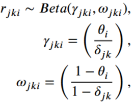

- $r_{jki}$: The observed response of the $i$-th ASR system for speech $jk$ (can be obtained from ICC formula)
- $\theta_i$: The ability of the $i$-th ASR system
- $\delta_{jk}$: The difficulty of the test speech $jk$ (sentence $j$, speaker $k$)
- Beta Distribution: to make responses bounded in [0, 1] interval

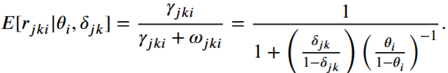

- Item Characteristic Curve (ICC): high ability system -> better responses are expected

#### 2nd level

- Objective: to explain why a speech is difficult by decomposing the speech difficulty (observed from level 1)
- Factors: estimates Sentence Difficulty ($w_j$) and Speaker Quality ($\varphi_k$)
- Terminology: term *Quality* is used for speakers to distinguish from *Ability* (from ASR systems)

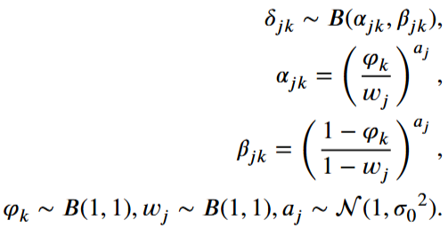

- $\varphi_k$: The speaker quality (ability of the $k$-th speaker)
- $w_j$: The sentence difficulty of the $j$-th sentence
- $a_j$: The sentence discrimination (measures how well a sentence distinguishes between different speaker qualities)

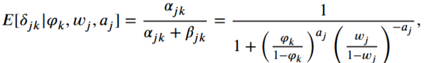

- This models how the "overall difficulty of a speech" is a product of "the specific sentence used" and "the clarity/quality of the speaker"

### 3.2 Speech difficulty and Recognizer Characteristic Curves

- Objective: to visualize how systems behave across different challenge levels
- Definition: RCC is a plot that shows an ASR system's average performances as a function of estimated speech difficulty
- Utility:
  - reveals robustness
  - helps in benchmark design
  - can find dominant curves (superior systems)

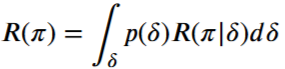

- $R(\pi)$: The overall performance of ASR system $\pi$
- $p(\delta)$: The distribution of speech difficulty in the test set
- $R(\pi|\delta)$: The system's performance conditioned on a specific difficulty level $\delta$

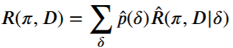

- $\hat{p}(\delta)$: The frequency of speeches in dataset $D$ at difficulty level $\delta$
- $\hat{R}(\pi, D|\delta)$: The average performance of the system for all speeches
  - sharing specific difficulty level
  - Y-axis of RCC

### 3.3 Speech difficulty decomposition and ASR Fingerprints

- ASR Fingerprint Definition
  - two dimension plot (using "Speaker Quality" and "Sentence Difficulty")
  - Maps the system's performance against two factors simultaneously
  - Purpose: identify if a system is specifically weak against poor speaker quality or complex linguistic structures

- Breaks down: The partial performance $R(\pi|\delta)$ -> "sentence difficulty ($\omega$)" and "speaker quality ($\phi$)"

 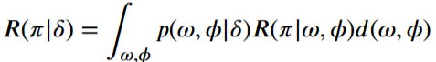

- By replacing $R(\pi|\delta)$ into $R(\pi)$

  ->

 

- when empiracally estimated ->

 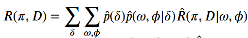

- $\hat{R}(\pi, D|\omega, \phi)$: The average performance observed (for a specific combination of speaker quality and sentence difficulty)
- This mapping creates the "fingerprint" or heat map of the system's strengths and weaknesses

## 4. Case Study

### 4.1 Synthesis of testing speeches

- Speaker: audio speeches were produced by adopting 4 TTS tools.
- Noise level: three levels of white noise was injected
- Total 7,500 speeches: (25 speakers) x (100 sentences) * (3 noise levels)

### 4.2 IRT fitting

- response matrix for IRT: speech sets are used to construct
- Word accuracy rate (WAcc):
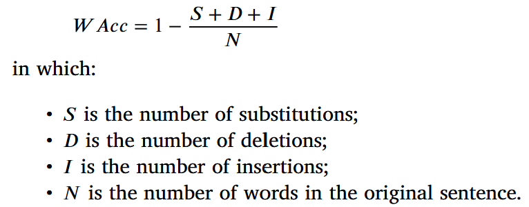
- ${𝛽^3}$-IRT
  - input: response matrix
  - output: ASR systems' ability, speeches' difficulties

### 4.3 Speech Difficulty Distribution

- Distribution of speech difficulties by the first level of the IRT model
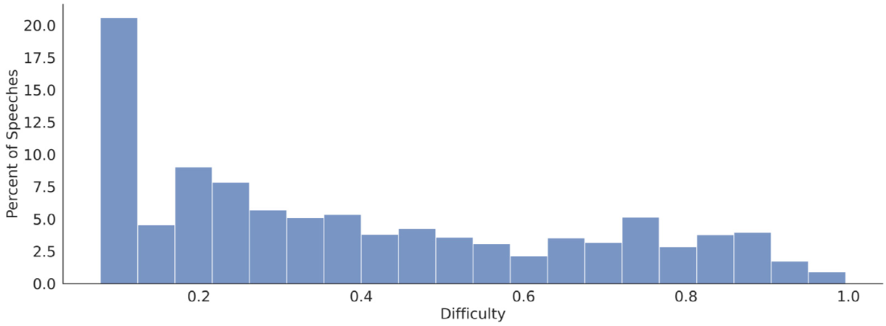
- Difficulty distribution within each noise level group
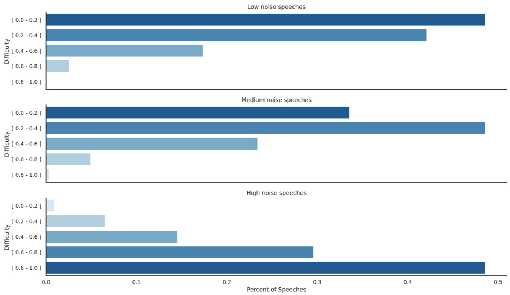
  - level of noise injection monotonically affects the difficulty of speeches

### 4.4 Recognizer Characteristic Curves

- RCC for each ASR system in the experiments
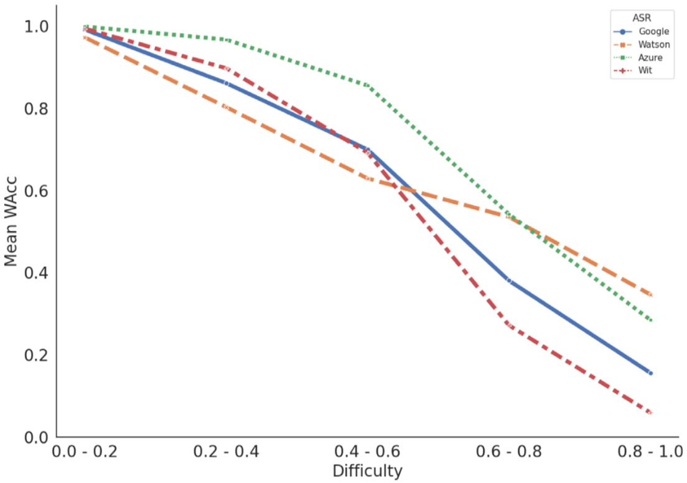
  - RCCs can be useful to reveal distinct patterns of performance that are missed by simply averaging a performance metric (like WAcc) across all test items
- 3 RCCs in different noise injection level
 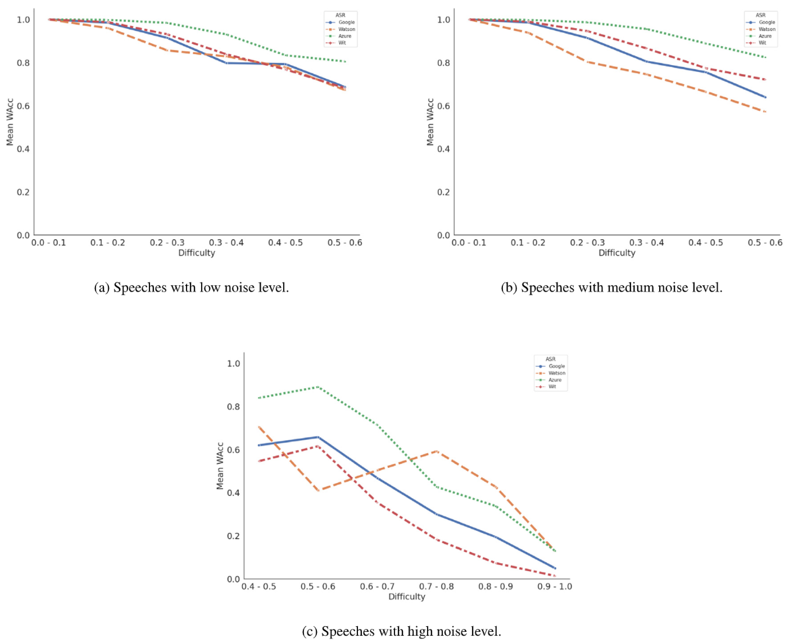
  - (a) low noise group: all systems obtained good responses
  - (b) medium noise group: no intersection between RCCs, all ASR systems have a downward trend. (Azure > Wit > Google > Watson) -> **best noise level to evaluate ASR systems**
  - (c) high noise group: none of RCCs has a consistnet behavior -> such noisy items should be discarded to improve test reliability

### 4.5 ASR Fingerprints

- Anaylise tool to inspect how the performance of an ASR system is affected by the sentences and speakers (explains speech difficulty)
- Replaced (1 dimension -> 2 dimensions): RCCs (the speech difficulty) -> ASR Fingerprint (speaker quality & sentence difficulty)
- ASR Fingerprints for each ASR systems considering all noise levels
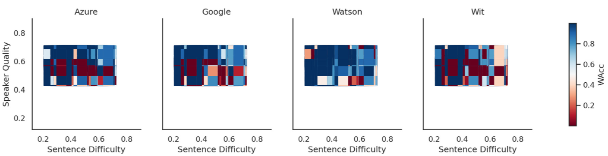
- ASR Fingerprints for each ASR systems considering each group of noise injection
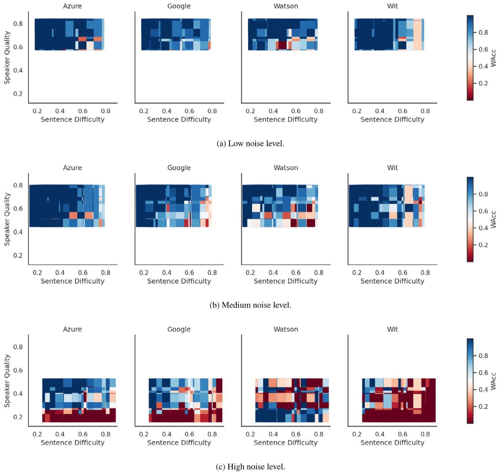
  - (a) Low noise group: the superiority of a single system is not clear in the fingerprint in any dimension
  - (b) Medium noise group
    - Azure is the most robust system
    - including bit more noise -> more diversity (in terms of sentence difficulty and speaker quality)
  - (c) High noise group
    - Azure, Google, Wit: have poor performance for speakers with lower quality (regardless of sentence difficulty)
    - Watson: confusing
  - Medium noise is more indicated to use for ASR testing
- ASR Fingerprints for each ASR systems considering only low and medium noise speeches
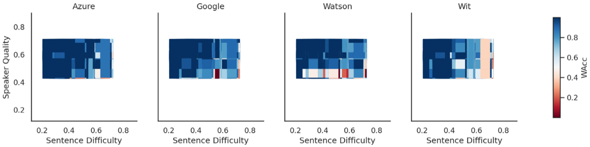
  - more coherent than Fig.5
- Contribution
  - Testing plan design in different scenarios of evaluation can be supported
  - The synthesis of new test items in an adversarial way can be supported

## 5. Discussion

### 5.1 Noise Injection

- Contribution:
  - Noise injection was useful in producing new test items to stress the systems under evaluation
  - Analysis provided by RCCs could reveal impact of each noise injection on each ASR system's performances and suggest adequate noise injection levels to produce appropriate test data.
- Future work: richer noise types can be adopted

### 5.2 Human vs Synthetic test items

- Contribution: synthetic test items can produce diverse test items with high scalability and cover many potential types of users
- Limitation: Synthetic test items cannot express complex nuances that only humans voices possess
- Future work: Synthetic speech and human-record speech can be compared in terms of difficulty -> their relative usefulness to evaluate ASR systems

### 5.3 Speech variability and data representativeness

- Contribution: many factors which makes speech diverse can be evaluated via proposed framework.
- Future work: larger and representative test benchmarks can be relevant to produce with the emergence of general purpose AI interfaces.

## 6. Conclusion

1. Contribution
    - IRT-based framework is proposed to evaluate ASR systems by taking into account the difficulty of each test item.
        - IRT model measured the difficulty of each test speech
        - RCC curves are proposed to inspect the performance of each system along range of difficulty
        - Fingerprint maps: speech difficulty is decomposed into speaker quality and sentence difficulty
    - useful to verify the performance of a system on hardest ones
    - useful to verify the power of the test items in a given benchmark (usefulness, realiability, discrimainative)
2. Case Study
    - Low noise level: little diversity in terms of difficulty -> does not contribute well to discriminate performance
    - Medium noise level: appropriate
    - High noise level: greatly impacts the difficulty, but results in an inconsistent and unreliable assessment
    - Future work
        - Noise injection: more elements can also be added (volume, pitch, rate and other types of background noise)
        - Other speech variability producing (age, gender, accents, emotional states)
