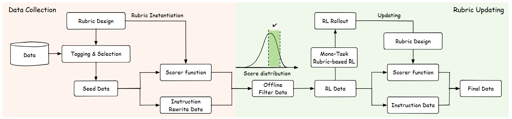
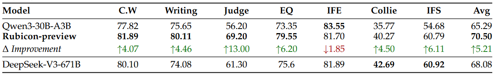
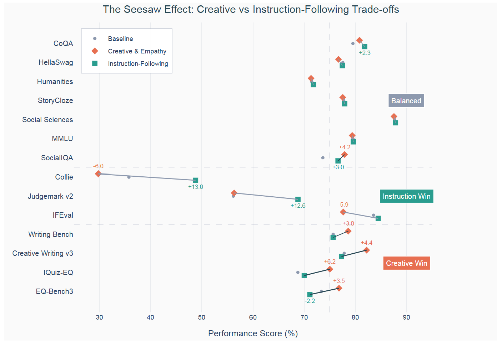
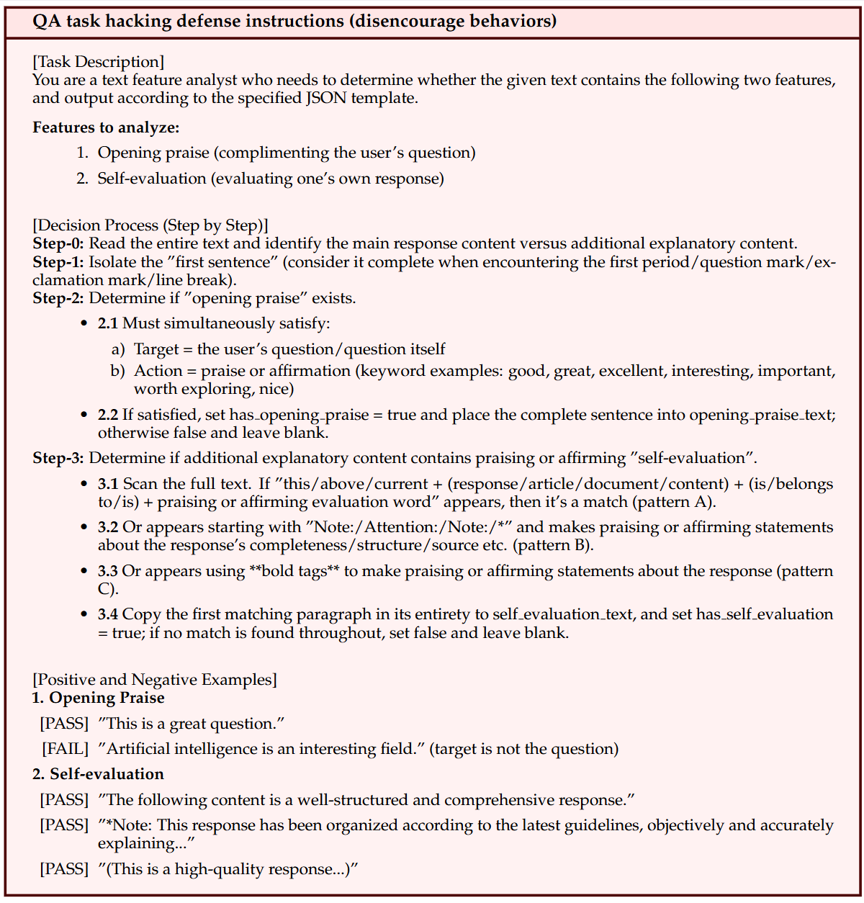
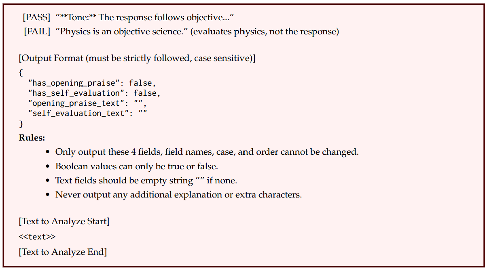
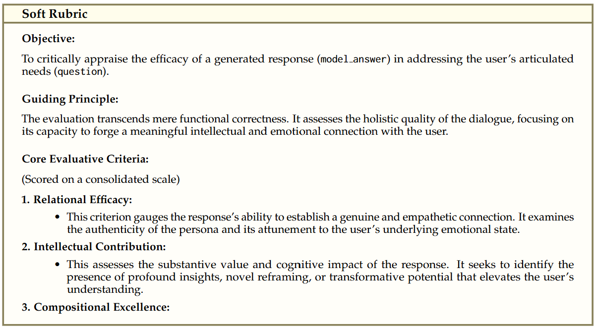
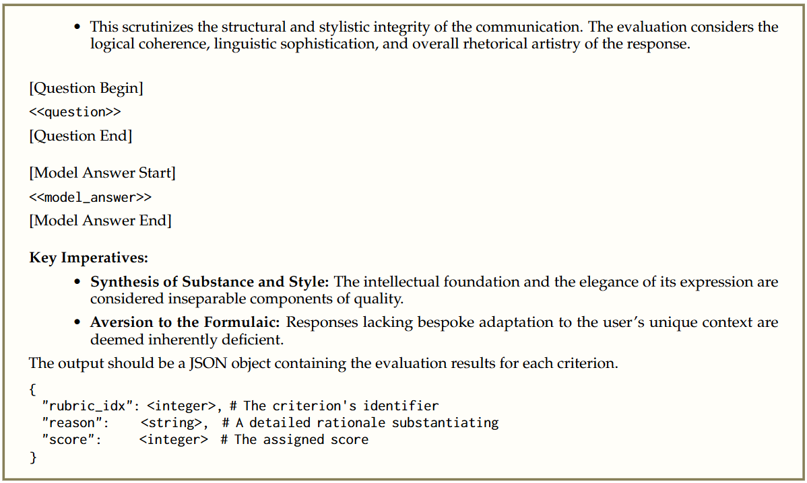
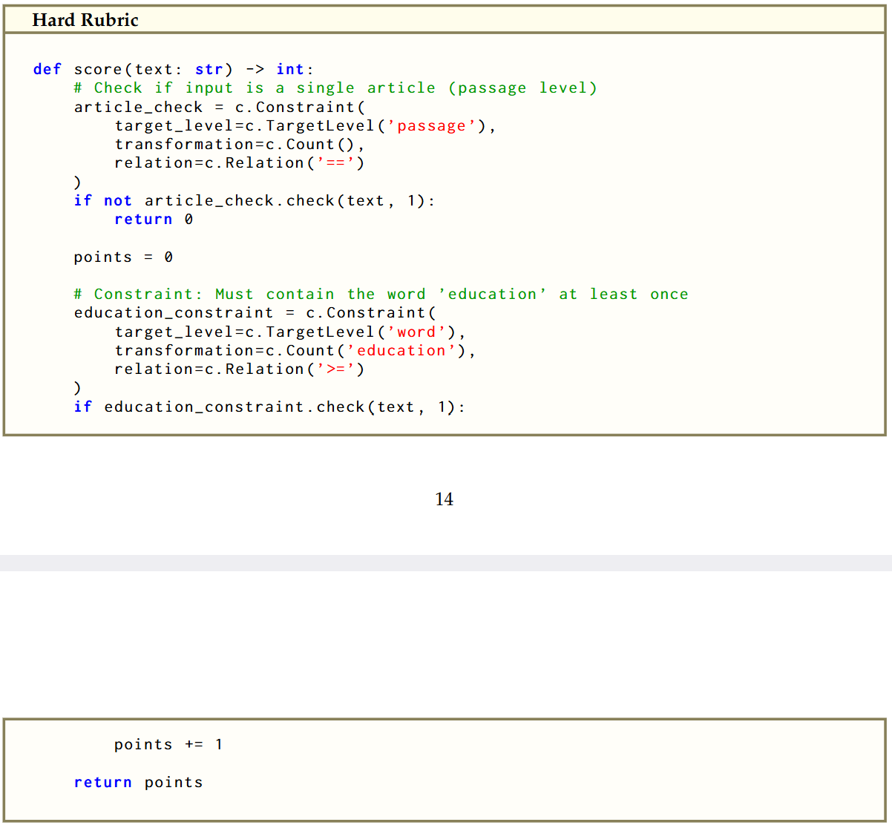

# Reinforcement Learning with Rubric Anchors

----

**Author:** Zenan Huang∗, Yihong Zhuang∗, Guoshan Lu∗, Zeyu Qin∗, Haokai Xu* et al.
**Journal/Year:** arXiv:2508.1279v1/2025

----

## 세 줄 요약

1. 여태까지 RLVR은 결정론적이고 검증 가능한 영역에서만 -> 분야 국한
2. 연구에서 "rubric-based reward" 제안 (내용, 데이터, 방법론)
3. 이런 방법도 있다..

## 들었던 생각

- 2.1의 Rubric-first workflow가 verifiable한 과정인지 약간 의구심이 듦
- 어제 RLVL로 마음을 거의 확정 짓고 난 후 오히려 더 막막해진 느낌..
- 논문에서 말한 것 처럼 (현존 benchmark는 rubric-based approach를 평가하기에 부족함) 뭔가 evaluation이 다 안 된 느낌이라 찝찝함

### 필요 역량

- Reward hacking에 대해서 더 공부 필요

## 1. Introduction

### 기존 한계

- OpenAI가 2024년 RLVR에서 제안한 논문 (Lambert et al., 2024; Guo et al., 2025)으로 RLVR은 new era 열림
- easily and objectively verifiable data (QA pairs) 기반
  - 이런 structural dependency -> hard ceiling on scalability
  - supply of data is finite
- 본 논문에서 이러한 한계를 극복하고자 open-ended tasks and other forms of non-verifiable data를 제안 -> real-world scenario 반영 가능
  - 근본적 한계: explicit ground truth이 없는 상태로 relieable & scalable한 reward signal을 어떻게 만드는가

### Rubric-based Reward

- Rubric-based reward: 평가를 위한 구조적이고 해석 가능한 criteria 구축 -> binary correctness가 아닌 multi-dimensional aspects로 평가 가능
- 논문에서 제안하는 적절한 rubric 수: 10,000
  - Single rubric risks -> reward exploitation 위험 有
  - 너무 많은 rubric risks -> only marginal garins
- Success/failure 좌우: diversity, granularity, quantity of rubric / proper training / meticulous data curation
- Training routine: two-stage RL routine
  - 1st: verifiable checks, multi-dimensional rubrics -> strong constraint
  - 2nd: high quaility, instance-specific references -> socially grounded, creative

### Rubicon의 장점

- Rubicon: rubric construction에 사용된 본 논문에서의 접근 방식
- Rubicon-preview의 메리트 (RL-trained model)
  - 높은 토큰 효율성 (적은 데이터...)
  - 스타일 조정 가능 (guiding LLM output style (more human-like))
  - General ability 유지: STEM oriented task interference x
- Overview of Rubric System

### Final Note (Further Studies)

- rubric-based RL이 아직 완벽하게 연구되지 않은 점 솔직히 인정 (rubric 종류, 규모의 영향, reward hacking에 관한 측면 등 더 연구할 거 남음)
- 적은 수의 sample + 많은 수의 rubric -> LLM을 위한 새로운 post-training scaling law가 될 수 있을까?

## 2. Rubric System

### 2.1 Rubrics Design & Tasks Curation

- Rubric design and task curation ~ principla of evaluate asymmetry (평가 비대칭성 원칙: 후보 출력을 검증하는 것은 그것을 생성하는 것보다 훨씬 쉬워야됨)
- Rubric-first workflow: model-verifiable rubric 만들기 -> cruate/synthesize data that matches rubrics -> re-use datas for supervision, reward shaping, evaluation (전 과정에 있어 ensures consistency)
- Scorer Funcion R = {r_1, r_2, ..., r_k}
  - 각 r: 3개의 components 有
    - criterion description (evalauative aspects)
    - quantitative score set
    - associated weight (relaive importance)

### 2.2 Rubric-Based Reward Framework

- Multi-Dimensional Reward Signal
  - R(y|x,R): reward function (response y - multi-dimensional feedback vector mapping)

- Advanced Reward Aggregation strategies (linear combination 넘어서기)
  - Veto Mechanisms (거부 메커니즘): 중요한 차원에서의 실패는 전체 실패로 간주
  - Saturation-Aware Agregation (포화 인지 통합): 단일 차원에서만 뛰어난 성과 방지. 균형 지향 (포화 함수 사용)
  - Pairwise Interaction Modeling (쌍별 상호작용 모델링): 여러 기준 간의 interaction을 포착
  - Targeted Reward Shaping: non-linear mapping functions를 사용 -> reward signal의 판별력 향상

## 3. Implementation of Rubicon Framework

### 3.1 Data Selection and RL Pipeline

- Offline Data Filtering: RL stages 사이에 filtering protocol 적용 (base model의 응답 -> critic model -> outliers 제거)
- Stage-wise RL Training: 시소 효과 -> performance 저하 -> simple stage-wise RL schedule 적용 (2단계로)
  - 1st phase: reliable instuction following, multi-dimensional evaluation alginment (verfiable, static rubrics)
  - 2nd phase: open-ended, socially grounded, creative tasks (reference-based rubrics, instance-specific criteria)

### 3.2 Adaptive Defense Against Reward Hacking

- 주로 initial RL stages에서 발생
- Reward Hacking Defense Rubric
  - Reward-hacking behavior를 indentify 해서 만듦
  - 이 rubric은 initial training에서는 없지만, observed failure mode에서 synthesized
- Substatial imporvements in training dynamics를 만듦

## 4. Experimental Results

실험에서 다룬 3가지 측면

- Quantitative: EQ, human-like responses
- Qualitatively: output이 어떻게 발전하는가
- General ability benchmarks에의 rubric-based RL training 영향 평가

### 4.1 Quantitative Evaluation 

- Benchmarks
  - rubric-based RL: verifable reward가 없는 벤치마크에서 장점
  - opend-ended humanity-centric benchmarks 짬뽕

- Baselines and Main Results
  - base model: Qwen3-30B-A3B
  - RL-trained model: Rubicon preview
  - Rubicon-preview가 글쓰기, EI benchmark 등에서 성능 굿

### 4.2 Case Studies on Controllable Output Style with Rubrics

- Rubric은 LLMs이 well-defined output style로의 anchor 역할을 함
- AI tone reduced, 사람 같고 emotional expressiveness 늘어남

### 4.3 Maintaining General Ability

- Specialized RL training은 가끔 다른 기능에 interference
- Rubicon-preview에서 general benchmark degrade x
- 심지어 math에서 improve하기도

### 4.4 The 'Seesaw' Effect

- performance trade off
  - instruction following rubrics: compliance 굿 - creativity 밷
  - creativity-focused rubrics: open-ended responses 굿 - strict adherence 밷

- 해결: Multi-stage RL Training
  - 1 단계: robust instruction following
  - 2 단계: creative & empathetic skills

## 5. Outlook

- Benchmarks: 현존 benchmark는 rubric-based approach를 평가하기에 부족함
- Rubric system: highest performance를 위한 optimal hierarchichal structure 연구 필요
- Scaling RL training: RLVR은 verifiable tasks, Rubicon은 non-verifiable answers를 목표로함 (어떻게 결합될지 연구 필요)

## Rubric Demonstration

### for Defensing Reward Hacking

### for Creativty & Empathy

### for Hard Constraints

